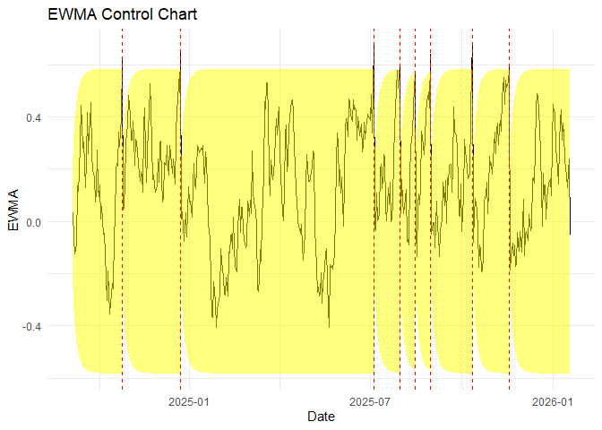

<!-- README.md is generated from README.Rmd. Please edit that file -->

# controlcharts

<!-- badges: start -->

[](https://github.com/StatEcon1989/controlcharts/actions/workflows/R-CMD-check.yaml)
[](https://app.codecov.io/gh/StatEcon1989/controlcharts)
<!-- badges: end -->

CURRENTLY IN DEVELOPMENT: Control charts allow real time testing for
upwards and/or downwards shifts in a process without the need to wait
for enough observations to apply tests for structural changes. The
package allows performing these control charts fast and efficiently by
using C++.

## Installation

You can install the development version of controlcharts from
[GitHub](https://github.com/) with:

``` r
# install.packages("pak")
pak::pak("StatEcon1989/controlcharts")
```

## Example

This is a basic example which shows how you could easily apply an EWMA
control chart if your data is tabulated (this example requires
data.table):

``` r
library(controlcharts)
# create the example data
T <- 500L # length of the time series
table <- data.table::data.table(X = rnorm(n = T, mean = 0.25), TIME = Sys.Date() + 1:T) # simulating the (out-of-control) data as table

# parametrization of the EWMA control chart
side <- "both"
lambda <- 0.1
ARL <- 250L

# calculate the critical value for the control limits of the EWMA chart
h <- calculate_control_limit_ewma(lambda = lambda, ARL = ARL, fir = TRUE, side = side,
                                  replications = 2000L)
# apply the EWMA and append the corresponding columns
table[, c("z", "upper_limit", "lower_limit", "exceedance") := ewma_cc(x = X, lambda = lambda, h = h, fir = TRUE, side = side)]
head(table)
#>              X       TIME           z upper_limit lower_limit exceedance
#> 1:  0.34623881 2024-09-06  0.03462388   0.2541009  -0.2541009      FALSE
#> 2: -0.98658819 2024-09-07 -0.06749733   0.3418578  -0.3418578      FALSE
#> 3: -0.62339812 2024-09-08 -0.12308740   0.3990355  -0.3990355      FALSE
#> 4:  0.24578250 2024-09-09 -0.08620041   0.4399353  -0.4399353      FALSE
#> 5:  2.12705236 2024-09-10  0.13512486   0.4704648  -0.4704648      FALSE
#> 6: -0.04227835 2024-09-11  0.11738454   0.4938121  -0.4938121      FALSE

# plot the control chart
table[, plot_ewma(.SD, dates = TIME)]
```


